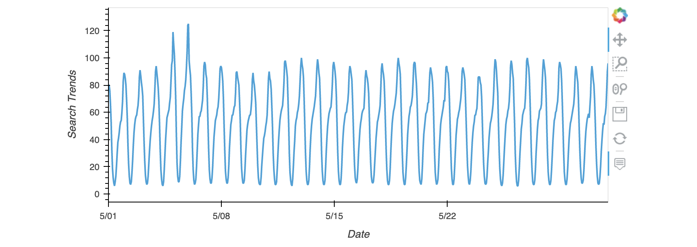
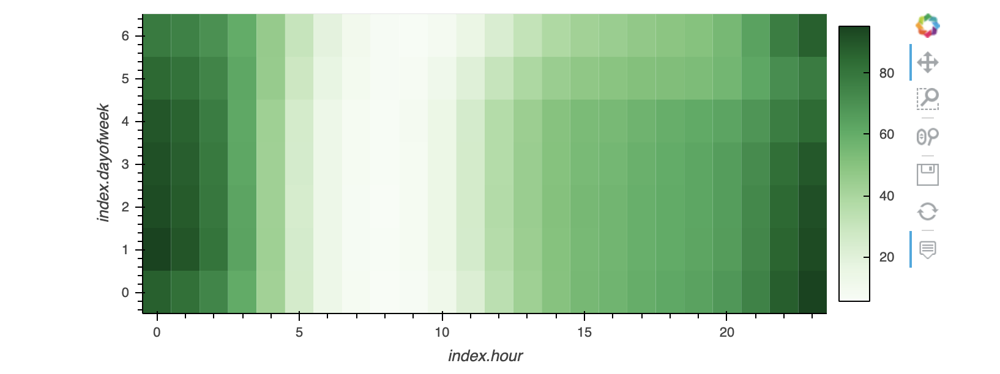
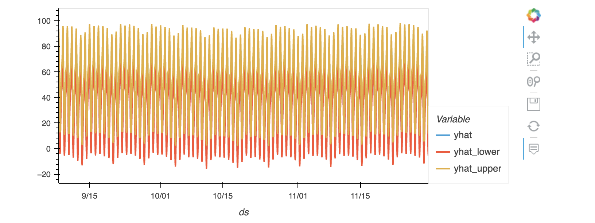
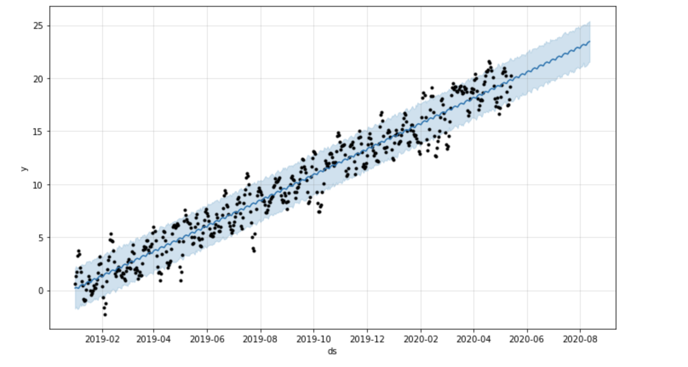

# Forecasting MercadoLibre

With over 200 million users, MercadoLibre is the most popular e-commerce site in Latin America. We will analyze the company's financial and user data in ways to make the company grow. Therefore, we intent to find out if the ability to predict search traffic can translate into the ability to successfully trade the stock.

## Sections:

### Unusual Patterns in Hourly Google Search Traffic

    - In this section, we will analyse if the Google search traffic for the company links to any financial events at the company, or whether the search traffic data just present random noise. We will pick out any unusual patterns in the Google search data for the company, and connect them to the corporate financial events.



### Mine the Search Traffic Data for Seasonality

    - In this section, we will track and predict interest in the company and its platform for any time of day, so that the company can focus their marketing efforts around the times that have the most traffic. This will get a greater return on investment (ROI) from the company's marketing budget.



### Relating the Search Traffic to Stock Price Patterns

    - In this section, we will analyse if there is any relationship between the search data and the company stock price.


### Create a Time Series Model with Prophet

    - In this section, we will produce a time series model that analyzes and forecasts patterns in the hourly search data. 


### Forecast Revenue by Using Time Series Models

    - In this section, we will forecast of the total sales for the next quarter, which will increase the company's ability to plan budgets and to help guide expectations for the company investors.



## Tecnologies required and installation guide:

* **Prophet**

``` pip install prophet ```


## Instructions

Use the `forecasting_net_prophet.ipynb` notebook to visualize and analyze the performance of any ETF.

Note that this application requires the use of hvPlot for the visualizations.

## Contributors

Jaime Aranda


---

## License

Licensed under the MIT License.